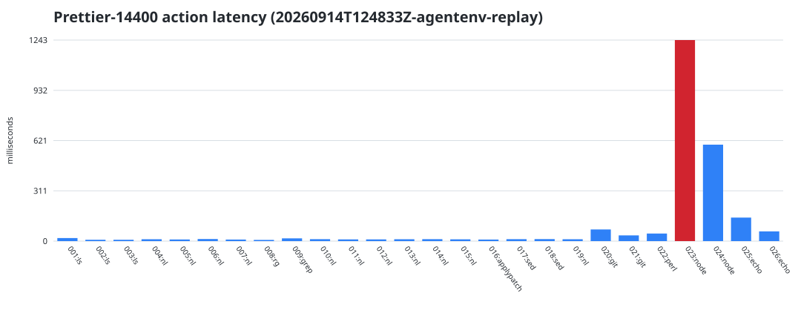
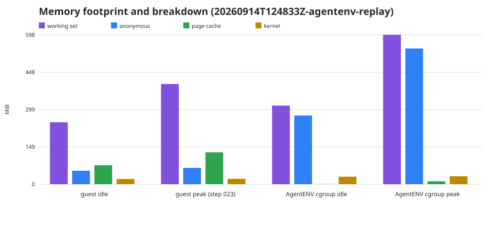

# AgentENV / prettier-14400 实验结果

更新时间：2026-09-14T12:48:41+00:00。完整 raw runs：3；下列明细对应最新运行 `20260914T124833Z-agentenv-replay`。

## Summary

- 固定输入：26-action Tracebench replay；镜像 `ghcr.io/timesler/swe-polybench.eval.x86_64.prettier__prettier-14400@sha256:e625c9b9776870e2cc87172e886bbc90cfc3d6ce1521492f113a46b3f6dfcf44`。
- OverlayBD I/O 模式：`ioEngine=2`（`2` 表示本地只读 lower commit 使用 `O_DIRECT`）。
- sandbox 配额：2 vCPU / 4096 MiB；冷启动 2573.4 ms（不计入 workload）。
- 26 个 action 总 wall time 2414.5 ms，均值 92.864 ms，中位数 11.787 ms，最慢 action 023 为 1242.980 ms。
- 非零 action：008=127, 016=127。原轨迹中的 008（镜像无 `rg`）和 016（无 `applypatch`）允许失败，runner 仍继续重放 observation-driven 修复路径。
- task-specific oracle：通过；sandbox 清理：已确认删除。
- patch 人工复核提示：功能修复存在，但新增 `svg:script`/`svg:style` 行缩进偏深；本次只证明 oracle 行为，不视为可直接提交的补丁。
- guest idle working-set 估算 247.9 MiB，workload 峰值 400.8 MiB（step 023）；峰值 page cache 127.5 MiB、匿名页 65.3 MiB。
- host 上 AgentENV 容器 cgroup idle/峰值 memory.current 为 314.6/597.7 MiB；活跃 Firecracker RSS idle/峰值为 227.6/495.2 MiB。

## 运行对照

| run | OverlayBD mode | action total (ms) | median (ms) | guest peak (MiB) | AgentENV cgroup peak (MiB) | oracle |
| --- | --- | ---: | ---: | ---: | ---: | --- |
| `20260914T-direct-io-agentenv-replay` | direct (2) | 2521.1 | 14.301 | 316.4 | 585.1 | 通过 |
| `20260914T074428Z-agentenv-replay` | buffered (0)* | 2414.8 | 10.281 | 327.4 | 5902.2 | 通过 |
| `20260914T124833Z-agentenv-replay` | direct (2) | 2414.5 | 11.787 | 400.8 | 597.7 | 通过 |

`*` 第一轮 runner 尚未写入 `ioEngine`，但开启 Direct I/O 前对实际生成配置的检查值为 0。
两轮之间为了让 ublk daemon 重新加载配置重启过 Docker 容器；重启会解除旧 cgroup 对
host page cache 的记账。因此 cgroup memory 的两行不能作为严格的 buffered/direct
节省量对比，尤其不能把数 GiB 差值全部归因于 `O_DIRECT`。

## 逐工具/action 延迟

| action | 主工具 | duration (ms) | exit |
| ---: | --- | ---: | ---: |
| 001 | `ls` | 18.601 | 0 |
| 002 | `ls` | 8.212 | 0 |
| 003 | `ls` | 8.095 | 0 |
| 004 | `nl` | 11.453 | 0 |
| 005 | `nl` | 10.079 | 0 |
| 006 | `nl` | 12.669 | 0 |
| 007 | `nl` | 9.659 | 0 |
| 008 | `rg` | 7.426 | 127 |
| 009 | `grep` | 16.836 | 0 |
| 010 | `nl` | 11.734 | 0 |
| 011 | `nl` | 10.557 | 0 |
| 012 | `nl` | 10.444 | 0 |
| 013 | `nl` | 11.633 | 0 |
| 014 | `nl` | 11.839 | 0 |
| 015 | `nl` | 11.023 | 0 |
| 016 | `applypatch` | 9.598 | 127 |
| 017 | `sed` | 12.080 | 0 |
| 018 | `sed` | 12.512 | 0 |
| 019 | `nl` | 11.647 | 0 |
| 020 | `git` | 71.800 | 0 |
| 021 | `git` | 35.457 | 0 |
| 022 | `perl` | 46.605 | 0 |
| 023 | `node` | 1242.980 | 0 |
| 024 | `node` | 596.068 | 0 |
| 025 | `echo` | 145.433 | 0 |
| 026 | `echo` | 60.027 | 0 |

## 内存口径

- guest `working set = MemTotal - MemAvailable`，表示内核估算的当前不可立即回收占用；它不是 4096 MiB 配额，也不等于进程 RSS。
- guest `page cache = Cached + Buffers + SReclaimable - Shmem`；`anonymous = AnonPages`；`kernel = SUnreclaim + KernelStack + PageTables + Percpu`。这些是并列诊断项，不应相加后当成严格互斥总量。
- `guest idle` 在 action 前、可选 `drop_caches` 后采样，代表本次 VM/项目运行时基础内存；每个 action 有 before/20ms sampling/after 记录，极短 action 的瞬时尖峰仍可能漏采。
- host `AgentENV cgroup` 包含 server、ublk daemon、warm-pool Firecracker 和本次 sandbox。由于 AgentENV 当前没有 per-sandbox host cgroup，`file`（host page cache）只能在服务粒度报告；实验要求运行前没有其他 active sandbox 来减少归因歧义。
- Firecracker RSS/PSS 来自 host `/proc/<pid>/smaps_rollup`，采样器选择 RSS 最大的活跃 Firecracker；它不包含独立 ublk daemon 的 page cache。

### 为什么旧运行的 AgentENV cgroup 是几 GB

开启 Direct I/O 前的现场值为：`memory.current=5,655,949,312` bytes，其中
`file=5,405,487,104`、`anon=53,432,320`、`kernel=189,259,776` bytes；同时容器内
`/workspace/env/image-cache/commits` 的磁盘文件总量约为 5.1 GiB。这说明几 GB 主要是
AgentENV 在该 Docker cgroup 中读取/转换 OverlayBD commit 后形成的 **host file page
cache 记账**，不是单个 Firecracker/sandbox 的匿名内存。第一轮的 Firecracker RSS
峰值只有约 494.8 MiB，也支持这一判断。

Docker cgroup 的 file cache 是可回收的，且会在容器重启后解除原 cgroup 的记账；它既
不等于常驻、不可回收内存，也不能完全归属于某一个 sandbox。Direct-I/O 运行期间 host
cgroup file 峰值仅约 12.6 MiB，但因切换模式必须重启 daemon/container，这个数值同时
受到 `O_DIRECT` 和 cgroup 重新记账两个因素影响。

## 正确性与可复现性

oracle 检查 action 024 的 Prettier 输出是否把 SVG `<script>` 中两条关键 JavaScript 语句展开到预期缩进。`replay/patch.diff`、全部 stdout/stderr、guest/host 原始采样、镜像 digest、action manifest digest 和清理日志均保存在 [`raw/20260914T124833Z-agentenv-replay/`](raw/20260914T124833Z-agentenv-replay/)。

本结果是单次 AgentENV block baseline 的功能与测量管线验证，不能据此宣称 block 与 DAX 的性能差异。正式比较应做多次独立重复，并在相同 cache policy、CPU/内存配额和固定 action manifest 下报告方差。
